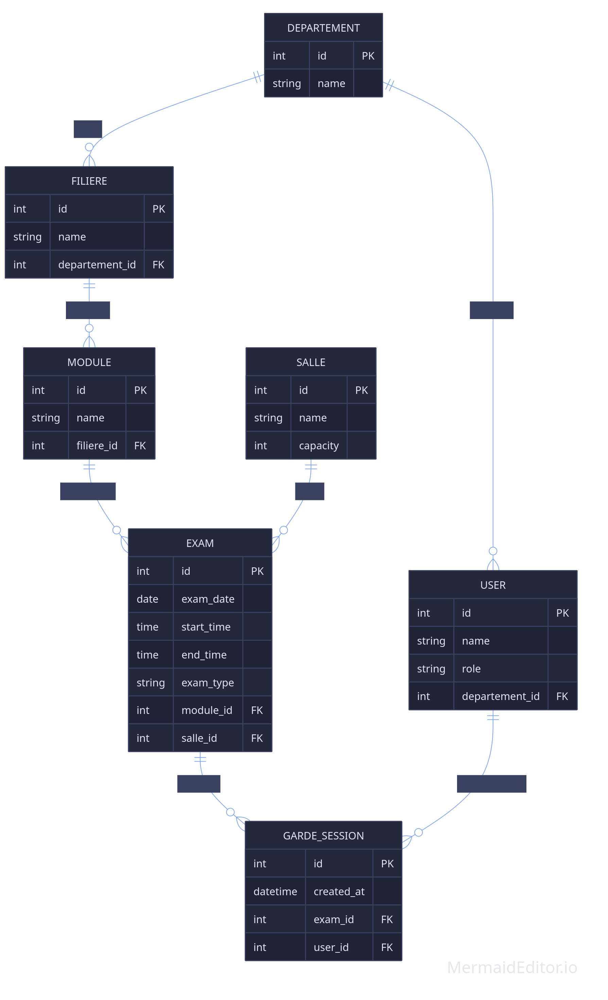

# FPK Exam Guard: University Invigilation Management Platform

**FPK Exam Guard** is a professional, industrial-grade management system designed for the **Faculté Polydisciplinaire de Khouribga (FPK)**. The platform streamlines the complex process of scheduling university exams and managing faculty invigilation (Garde) duties with a focus on institutional rigor and algorithmic fairness.

---

## 👨‍💻 Creator Information
**Yahya Bouchak**  
*Master SIIA (Information System and IA)*

---

## 🏛️ Project Architecture & Design
The platform adheres to a strictly professional **90-degree architectural aesthetic**, utilizing a high-authority color palette of **Institutional Brown, Black-Brown, and Bone White**.

### Database Schema

### Use Case Diagram

---

## 🚀 Key Functional Modules

### 1. Unified Control Center (Admin)
A comprehensive analytical dashboard for administrators to monitor institutional data in real-time.
- **KPI Tracking:** Monitor active professors, scheduled exams, and salle availability.
- **Analytical Visuals:** High-impact circular graphs for staff quota distribution and departmental load.
- **Resource Management:** Full CRUD capabilities for Staff, Exams, Salles, and Departments.

### 2. Algorithmic Assignment Engine
The core intelligence of the platform that automates the allocation of invigilation duties.
- **Fair Allocation:** Randomization logic to ensure equitable distribution of duties.
- **Strict Constraint Validation:** Automatic checks for departmental alignment and the maximum 4-guards-per-semester quota.
- **Conflict Resolution:** Real-time identification of logistical overlaps requiring administrative intervention.

### 3. Faculty Duty Portal (Professor)
A personalized, distraction-free environment for professors to manage their institutional responsibilities.
- **Duty Timeline:** Structural view of upcoming invigilations with room and time synchronization.
- **Quota Tracking:** Visual progress indicators for mandatory semester guards.
- **Incident Logging:** Formal communication channel to report schedule conflicts or room issues directly to the administration.
- **Institutional Archive:** Access to historical assignment data and official transcript exports.

---

## 🛠️ Tech Stack
- **Framework:** React 19 (Vite)
- **Language:** TypeScript
- **Styling:** Tailwind CSS v4 (PostCSS)
- **Icons:** Lucide React
- **Visuals:** Recharts
- **Animations:** Framer Motion

---

## 🔐 System Access
Access is governed by a secure, role-based authentication portal:
- **Admin System:** Strategic oversight and logistical management.
- **Professor System:** Duty management and departmental compliance.
